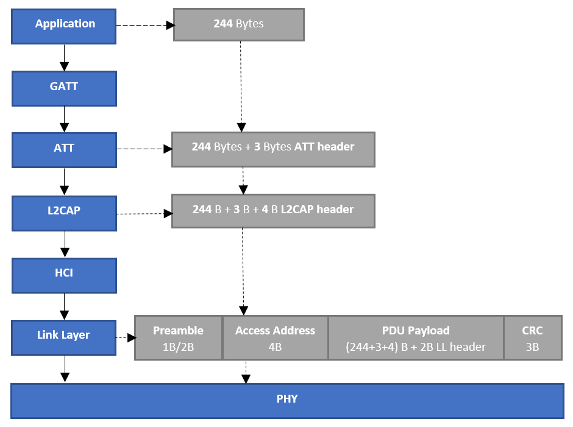

# PSoC 6 MCU: BLE Throughput Measurement (FreeRTOS)

This code example demonstrates BLE throughput measurement (using GATT layer notifications and GATT write command) using PSoC® 6 BLE MCU.

This code example has two applications:
1. **BLE GATT Server Throughput Measurement**: This application sends GATT notifications and calculates BLE Tx throughput, and receives GATT Writes and calculates BLE Rx throughput.

2. **BLE GATT Client Throughput Measurement**: This application sends GATT write commands and calculates BLE Tx throughput, and receives GATT notifications and calculates BLE Rx throughput.

This code example uses FreeRTOS. Visit the [FreeRTOS website](https://www.freertos.org) for documentation and API references of FreeRTOS.

**NOTE**: This code example can also be used with other Cypress BLE devices (CYW208xx and CYW207xx) programmed with the [BLE throughput measurement code example](https://github.com/cypresssemiconductorco/mtb-example-btsdk-ble-throughput), which is similar to this code example. It has two apps: one for GATT Server and another for GATT Client.

## Requirements

- [ModusToolbox™ software](https://www.cypress.com/products/modustoolbox-software-environment) v2.1
- Programming Language: C
- Associated Parts: All [PSoC® 6 MCU](http://www.cypress.com/PSoC6) parts with BLE connectivity

## Supported Kits

- [PSoC 6 BLE Pioneer Kit](https://www.cypress.com/CY8CKIT-062-BLE) (CY8CKIT-062-BLE) - default target
- [PSoC 6 BLE Prototyping Kit](https://www.cypress.com/CY8CPROTO-063-BLE) (CY8CPROTO-063-BLE)


## Hardware Setup

This example uses the board's default configuration. See the kit user guide to ensure that the board is configured correctly.

Two PSoC 6 BLE boards are required to use this code example: one for BLE GATT Server throughput measurement and the other for BLE GATT Client throughput measurement. This CE uses the [E-ink display shield](https://www.cypress.com/documentation/development-kitsboards/e-ink-display-shield-board-cy8ckit-028-epd) that comes with [PSoC 6 BLE Pioneer Kit](https://www.cypress.com/CY8CKIT-062-BLE).

**Note**: The PSoC 6 BLE Pioneer Kit and the PSoC 6 WiFi-BT Pioneer Kit ship with KitProg2 installed. ModusToolbox software requires KitProg3. Before using this code example, make sure that the board is upgraded to KitProg3. The tool and instructions are available in the [Firmware Loader](https://github.com/cypresssemiconductorco/Firmware-loader) GitHub repository. If you do not upgrade, you will see an error like "unable to find CMSIS-DAP device" or "KitProg firmware is out of date".

## Software Setup

Install a terminal emulator if you don't have one. Instructions in this document use [Tera Term](https://ttssh2.osdn.jp/index.html.en).

To use a Windows PC as BLE Central for GATT Server Throughput Measurement application, install [CySmart Host Emulation Tool](https://www.cypress.com/documentation/software-and-drivers/cysmart-bluetooth-le-test-and-debug-tool). You will also need [CY5677 CySmart BLE 4.2 USB Dongle](http://www.cypress.com/documentation/development-kitsboards/cy5677-cysmart-bluetooth-low-energy-ble-42-usb-dongle)

To use an iOS or Android Smartphone as the BLE Central, download the CySmart app. Scan the following QR codes from your mobile phone to download the CySmart app.


**NOTE**: If you are using a Windows PC or iOS/Android smartphone as BLE Central, all features of the GATT Server throughput measurement application cannot be used. Throughput can be measured only for GATT notifications. In this case, throughput rates obtained will depend on connection parameters negotiated and PHY of the Central device.

## Using the Code Example

### In Eclipse IDE for ModusToolbox:

1. Click the **New Application** link in the Quick Panel (or, use **File** > **New** > **ModusToolbox Application**).

2. Pick a kit supported by the code example from the list shown in the **Project Creator - Choose Board Support Package (BSP)** dialog.

   When you select a supported kit, the example is reconfigured automatically to work with the kit. To work with a different supported kit later, use the **Library Manager** to choose the BSP for the supported kit. You can use the Library Manager to select or update the BSP and firmware libraries used in this application. To access the Library Manager, right-click the application name from the Project Workspace window in the IDE, and select **ModusToolbox** > **Library Manager**.

   You can also just start the application creation process again and select a different kit.

   If you want to use the application for a kit not listed here, you may need to update the source files. If the kit does not have the required resources, the application may not work.

3. In the **Project Creator - Choose Board Support Package (BSP)** dialog, choose the example.

4. Optionally, update the **Application Name:** and **Location** fields with the application name and local path where the application is created.

5. Click **Create** and complete the application creation process.

For more details, see the Eclipse IDE for ModusToolbox User Guide: *{ModusToolbox install directory}/ide_{version}/docs/mt_ide_user_guide.pdf*.

### In Command-line Interface (CLI):

1. Download and unzip this repository onto your local machine, or clone the repository.

2. There will be two applications (GATT_client and GATT_server) in the cloned/downloaded repo. On Linux and macOS, you can use any terminal application. On Windows, navigate to the modus-shell directory (*{ModusToolbox install directory}/tools_\<version>/modus-shell*) and run *Cygwin.bat*.

3. Import the required libraries by executing the `make getlibs` command.

4. Navigate to the second application folder (GATT_server) and import the required libraries by executing the `make getlibs` command.

### In Third-party IDEs:

1. Follow the instructions from the CLI section to download or clone the repository, and import libraries using the `make getlibs` command.

2. Export the application to a supported IDE using the `make <ide>` command. 

   To export this code example, you need to execute `make <ide>` twice because there are two applications in the same project. 
   - First, navigate to the GATT_client application folder and call `make <ide>`. 
   - Next, navigate to the GATT_server application folder and repeat the command.

3. Follow the instructions displayed in the terminal to create or import both the applications as an IDE project.

For more details, see the "Exporting to IDEs" section of the ModusToolbox User Guide: *{ModusToolbox install directory}/ide_{version}/docs/mtb_user_guide.pdf*.

## Operation

### Using Two PSoC 6 BLE Boards

Two PSoC 6 BLE boards (can be a combination of PSoC 6 BLE Pioneer Kit/PSoC 6 BLE Prototyping Kit) are required to work with this CE. 

1. Connect the first board to your PC using the provided USB cable through the USB connector.

2. Open a terminal program and select the KitProg3 COM port. Set the serial port parameters to 8N1 and 115200 baud. 

   You need two windows of serial terminal to view messages from GATT Server device and GATT Client device.

3. Program the board.

   ### Using Eclipse IDE for ModusToolbox:

   1. Select the **GATT_server** application in the Project Explorer.

   2. In the **Quick Panel**, scroll down, and click **\<Application Name> Program (KitProg3)**.

   ### Using CLI:

   1. From the terminal, navigate to the GATT_server application folder:

   2. Execute the `make program` command to build and program the application using the default toolchain to the default target. You can specify a target and toolchain manually:
        ```
        make program TARGET=<BSP> TOOLCHAIN=<toolchain>
        ```
        Example:

        ```
        make program TARGET=CY8CPROTO-063-BLE TOOLCHAIN=GCC_ARM
        ```
        **Note**:  Before building the application, ensure that the *deps* folder contains the BSP file (*TARGET_xxx.lib*) corresponding to the TARGET. Execute the `make getlibs` command to fetch the BSP contents before building the application.

   After programming, the application starts automatically. Confirm that "BLE THROUGHPUT MEASUREMENT : SERVER DEVICE" is displayed on the UART terminal as shown in [Figure 1](#Figure-1-Terminal-output-for-GATT-Server-when-it-is-advertising).

   ##### Figure 1. Terminal Output for GATT Server when It Is Advertising

   

4. Unplug the board, and then connect the second PSoC 6 MCU board to your PC using the provided USB cable through the USB connector. Follow steps 2 and 3 (In the section [Using Two Boards](#Using-two-boards)) again to program the second board with the **GATT_client** application.

   After programming, the application starts automatically. Confirm that "BLE THROUGHPUT MEASUREMENT : CLIENT DEVICE" is displayed on the UART terminal as shown in [Figure 2](#Figure-2-Terminal-output-for-GATT-Client).

   ##### Figure 2. Terminal Output for GATT Client

   

5. Connect the first board (programmed with **GATT_server**) to your PC and open its terminal to view UART messages. 
   If required, reset the board after opening the UART terminal.

6. Press button SW2 on your GATT Client device to start **scanning**. 

   The client will check for peer devices with name **‘TPUT’**. If it finds a device with this name, it will initiate connection. So, after pressing the button, the kits will be auto connected. **User LED 1** will turn ON after connection.

   ##### Figure 3. Terminal Output: Connection Parameters Exchange

   

   You should be able to see the throughput values (in kbps) on the terminal. After connection, the BLE GATT Client device will subscribe for notifications and the BLE GATT Server will start sending GATT notifications of 244 bytes. Throughput is calculated for every second and displayed on the terminal. 

   In this case, the BLE GATT Server will calculate the Tx throughput, while the BLE GATT Client will calculate the Rx throughput. User LED 2 will be ON while the device is sending notifications and will be OFF intermittently indicating GATT packet congestion. If an E-INK display shield is present, it shows the throughput values. The display is refreshed with new values every five seconds.

   ##### Figure 4. Terminal Output: Data Transfer Mode 1

   

7. Press button (SW2) on BLE GATT Client device. 

   Notifications are disabled, and GATT write is enabled. **User LED 2** on GATT server device turns OFF. **User LED 2** will be ON while the device is sending GATT write, and will be OFF intermittently indicating GATT packet congestion. If an E-INK display shield is present, it shows the throughput values. The display is refreshed with new values every five seconds.

   ##### Figure 5. Terminal Output: Data Transfer Mode 2

   

8. Press the button (SW2) again. 

   Notifications are enabled, and GATT write will stay enabled. **User LED 2** on both boards will be ON while the devices are sending GATT notifications/GATT write, and will be OFF intermittently indicating GATT packet congestion. If an E-INK display shield is present, it shows the throughput values every 5 seconds.

   ##### Figure 6. Terminal Output: Data Transfer Mode 3

   

9. Press button SW2 again to keep notifications enabled but to disable GATT write. 

   Consecutive button presses will change the mode of data transfer as mentioned in steps 7 and 8.

   If a disconnection occurs, the GATT Server device will start advertising again.

**Note:** To see debug traces, enable the `UART_DEBUG_ENABLE` macro in the *uart_task.h* file.

### Using CySmart Desktop Application as BLE Central

1. Connect the board to your PC using the provided USB cable through the USB connector.

2. Open a terminal program and select the KitProg3 COM port. Set the serial port parameters to 8N1 and 115200 baud.

3. Program the board with the *BLE_Throughput_Measurement GATT_server* application. See Step 3 of Section [Using Two PSoC 6 BLE Boards](#Using-two-PSoC-6-BLE-boards) to program the device.

4. Open the [CySmart desktop application](https://www.cypress.com/documentation/software-and-drivers/cysmart-bluetooth-le-test-and-debug-tool) and connect to the [CySmart CY5677 dongle](http://www.cypress.com/cy5677) (Central device). 

   See the [CySmart user guide](https://www.cypress.com/file/232316/download) to learn how to use the desktop application.

5. To measure the Tx GATT throughput of the board:

   1. Using the CySmart desktop application, **scan** and **connect** to the 'TPUT' device.

   2. If prompted, click **Yes** to update the connection parameters. 
   
      Refer to the [Connection Interval](#Factors-influencing-Throughput) section to understand how the connection interval affects the throughput. Once the connection is established, User LED 1 will be ON.

   3. Go to the **Device** tab and click **Discover all attributes**.

   4. Click **Enable all Notifications**. 
   
      The Tx GATT throughput values (in kbps) will be displayed on the UART terminal. User LED 2 will be ON while the device is sending notifications; it will be OFF intermittently indicating GATT packet congestion. If an E-INK display shield is present, it shows the throughput values. The display is refreshed with new values every five seconds.

   5. Click **Disable All Notifications** to stop measuring the GATT throughput.

   6. Click **Disconnect** to disconnect from the Central device.

### Using CySmart iOS/Android App on Smartphone as BLE Central

1. Connect the board to your PC using the provided USB cable through the USB connector.

2. Open a terminal program and select the KitProg3 COM port. Set the serial port parameters to 8N1 and 115200 baud.

3. Program the board with the *BLE_Throughput_Measurement GATT_server measurement* application. 

   See Step 3 of Section [Using two PSoC 6 BLE boards](#Using-two-PSoC-6-BLE-boards) to program the device.

4. Turn ON Bluetooth on your Android or iOS device and launch the CySmart app.

5. Swipe down on the CySmart app home screen to start scanning for BLE Peripherals; your device appears in the CySmart app home screen with the name 'TPUT'. Select your device to establish a BLE connection (refer [Figure 7](#Figure-7-Screenshots-of-Cysmart-App)). 

   Once the connection is established, User LED 1 will be ON.

6. Select **GATT DB** from the carousel view. (see [Figure 7](#Figure-7-Screenshots-of-Cysmart-App)). Swipe left or right to change carousel selections.

7. Select **Unknown Service** and then select the Characteristic with the **Notify** property.

8. Select **Notify** (see [Figure 7](#Figure-7-Screenshots-of-Cysmart-App)). 

   The device will start sending GATT notifications to the smartphone. User LED 2 will be ON while the device is sending notifications and will be OFF intermittently indicating GATT packet congestion. If an E-INK display shield is present, it shows the throughput values. The display is refreshed with new values every five seconds.
    ##### Figure 7. CySmart App
    

   The Tx GATT throughput values (in kbps) will be displayed on the UART terminal.

## Debugging

You can debug the example to step through the code. In the IDE, use the **\<Application Name> Debug (KitProg3)** configuration in the **Quick Panel**. For more details, see the "Program and Debug" section in the Eclipse IDE for ModusToolbox User Guide: *{ModusToolbox install directory}/ide_{version}/docs/mt_ide_user_guide.pdf*.

## Design and Implementation

### GATT Throughput Measurement

In this code example, BLE throughput is measured using GATT data sent/received by the application. The application accumulates the *number of data packets sent/received* and calculates the throughput each second .

GATT Throughput = ( number of bytes sent/received in 1 second * 8 bits ) bps

Or

GATT Throughput = ( number of bytes sent/received in 1 second * 8 bits )/1000 kbps

While calculating the throughput, you need to consider only GATT data bytes. All the header bytes appended to GATT data must not be considered. [Figure 8](#Figure-8-GATT-Data-Flow) shows the data flow through LE protocol layers and headers being appended in each layer.

##### Figure 8. GATT Data Flow



To achieve the maximum throughput:
* PHY is set to 2M
* ATT MTU is set to 247
* Connection interval in the range 67.5 msec - 75 msec is requested by the Peripheral
* Data Length Extension (DLE) is used
* The GATT data is 244 bytes

#### Factors Influencing Throughput

Some of the known factors that affect the data throughput are explained below:

1. **PHY**

    The PHY rate being used will have direct impact on the maximum data throughput. You can select either 1-Mbps or 2-Mbps PHY. In this code example, PHY is set to 2M after connection. If the BLE Central device does not support 2M PHY, the value falls back to 1M. The PHY selected is printed on the UART terminal.

2. **Connection Interval**

    BLE Connection Interval is the time between two data transfer events between the Central and the Peripheral device (in simple words, how often the devices talk). It ranges from 7.5 ms to 4 seconds (with increments of 1.25 ms). In a connection interval, there may be only one Tx/Rx pair or, if the PDU has the More Data (MD) flag set, multiple packets may be sent in the same interval. 
    
    A connection event is the time duration within the connection interval where there is actual Tx/Rx activity happening. The connection event is always less than the connection interval. A connection event will end 1 inter frame space (IFS) before connection interval. Therefore, the connection interval value chosen will impact the throughput.

    A BLE connection is established with the connection interval value set by the Central device. However, the Peripheral may request a different value. The Central device makes the final decision and chooses a value that may be different from, but closer to, the requested value. In this code example, the Peripheral device requests a connection interval value in the range 67.5 msec - 75 msec, but the value you get will depend on the Central device that you use. 
    
    The connection interval differs between iOS and Android. It also changes depending on the version of the OS running on the device. This is because the BLE radio may have to attend to other events from the OS and the number of packets sent per connection event may not reach the maximum possible by the BLE stack.

    Note that the CySmart desktop application has an option to change the connection interval but the CySmart mobile app doesn’t support that option. See the "Configuring Master Settings" section on the [CySmart User Guide](https://www.cypress.com/file/232316/download) for detailed instructions on connection parameters. Once a connection is established, the UART log will indicate the connection interval whenever it is changed.

3. **ATT Maximum Transmission Unit (MTU)**

    The minimum ATT MTU allowed is 23 bytes. This allows a maximum of 20 bytes of ATT payload (3 bytes are used for the ATT header and 4 bytes for the L2CAP header). There is no limit on the maximum MTU value.

    If the ATT MTU is exactly 247 bytes, 244 bytes of ATT data will fit into a single packet. If the MTU is greater than 247 bytes, the MTU will span multiple packets causing the throughput to go down because of increase in packet overhead and timing in between packets. Therefore, GATT data size chosen in the application is 244 bytes.

4. **Data Length Extension (DLE)**

    The DLE feature was introduced in version 4.2 of the Bluetooth specification. DLE allows the link layer packet to hold a larger payload up to 251 bytes ([Figure 9](#Figure-9-LE-Packet-Format)). This means that for one Tx/Rx pair, 244 bytes of GATT data can be sent/received with DLE enabled. If the GATT data is larger than 244 bytes, it is split, and takes multiple LL packets to be transmitted. This introduces header bytes for every chunk of data and therefore lower throughput. Older versions of BLE can support a maximum payload of 27 bytes.

5. **Packet Overhead**

    ##### Figure 9. LE Packet Format

    

    As shown in [Figure 9](#Figure-9-LE-Packet-Format), the LE packet includes many packet header bytes which get added up in each layer that are not accounted for in the application data throughput. To minimize the packet overhead, try to configure the ATT MTU size in such a way that the ATT payload data will always fit in a single LE packet. In this code example, the ATT MTU size used is 247 bytes, which exactly matches with the ATT payload data size of 244 bytes.

### Resources and Settings

Both the applications, GATT_server and GATT_client, use FreeRTOS. Four tasks are created in the application. They are listed below according to the priority assigned. The BLE task has the highest priority.

1. **BLE task**: This task initializes BLE and processes all the BLE events.
2. **LED task**: This task handles the LED activity.
   * User LED 1 is turned ON if the device is in active connection with a  BLE Central. It is turned OFF if the device loses the connection.
   * User LED 2 is used to indicate GATT congestion during data transmission from the device. If there is congestion, user LED 2 turns OFF; it turns ON for a successful data transmission.
3. **E-INK Display task**: This task initializes the E-INK display and displays the BLE throughput value every 5 seconds.
4. **UART task**: This task uses the RetargetIO middleware to print throughput values and other application messages over a UART terminal.

Three message queues are used.

1. **BLE Queue**: For tasks to send BLE commands to the BLE task.
2. **Led Queue**: For BLE task to send LED status commands to the LED task.
3. **UART Queue**: For tasks to send UART messages to the UART task.

A FreeRTOS Software timer of 1 second is configured to calculate Tx/Rx throughput. [Figure 10](#Figure-10-RTOS-firmware-flow-for-BLE-GATT-Server-Throughput-application) and [Figure 11](#Figure-11-RTOS-firmware-flow-for-BLE-GATT-Client-Throughput-application) show the RTOS firmware flow.

##### Figure 10. FreeRTOS Firmware Flow for BLE GATT Server Throughput Application


##### Figure 11. FreeRTOS Firmware Flow for BLE GATT Client Throughput Application


**BLE GATT Server Throughput Measurement**

In this code example, the kit acts as a BLE GAP Peripheral and GATT Server. When the kit is powered up, FreeRTOS tasks and queues are created, and the FreeRTOS scheduler takes control of the firmware. The BLE task initializes the BLE stack and registers the BLE stack event handler (an application-level callback function to process BLE events). After the BLE stack is ON, the kit starts advertising. The advertisement packet contains name of the device `TPUT` and Throughput Measurement Service UUID.  There is no timeout for advertisement.

A connection is established when any Client device sends a connection request. After connection, PHY is set to 2M and a request to update the connection interval is sent to GAP Client. The PHY selected and new connection interval values are displayed on the terminal.

The GATT Server has a custom service called "Throughput Measurement". This service has two characteristics called "Notify" and "WriteMe". The Notify characteristic has a Client Characteristic Configuration Descriptor (CCCD).

##### Figure 12. Throughput Measurement Custom Service


**Notify Characteristic:** This characteristic is used to send GATT notifications and has a length of 244 bytes. The bytes sent are used to calculate the Tx throughput.

* When the GATT Client writes the value '1' into the CCCD, notifications are enabled, and the GATT Server starts sending notification packets which has 244 bytes of data. Notifications are sent every millisecond. A millisecond timer is configured and used for this purpose.

* When the GATT Client writes the value '0' into the CCCD, notifications are disabled, and the GATT Server stops sending notifications.

**WriteMe characteristic:** This characteristic is used to receive GATT writes from the GATT Client device and has a length of 244 bytes. The bytes received are used to calculate the Rx throughput.

**BLE GATT Client Throughput Measurement**

In this code example, the kit acts as a BLE GAP Central and GATT Client. When the kit is powered up, FreeRTOS tasks and queues are created and the FreeRTOS scheduler takes control of the firmware. The BLE task initializes the BLE stack and registers the BLE stack event handler (an application-level callback function to process BLE events). After the BLE stack is ON, the application waits for a button press by the user to start scanning.

If the Central finds the peer device with the name 'TPUT', it sends a connection request. After the connection is established, the GATT Client subscribes for notification by writing into the CCCD of the 'Notify' characteristic. Once it starts receiving notifications, the packets are accumulated, and the Rx throughput is calculated every second. This is data transfer mode 1. 

In data transfer mode 2, The GATT Client disables notifications and starts sending GATT write commands with 244 bytes of data in each packet. In this mode, the Tx throughput is calculated by accumulating successfully sent data bytes. 

In data transfer mode 3, the GATT client enables notifications and continues sending GATT write commands. Both Tx and Rx throughput are calculated in mode 3.

Pressing the user button (SW2) switches between the three modes of data transfer. There are three modes defined in the application:
1. GATT notifications from Server to Client
2. GATT write from Client to Server
3. Both GATT notifications and GATT write

##### Figure 13. Three Modes of Data Transfer


## Related Resources

| Application Notes                                            |                                                              |
| :----------------------------------------------------------- | :----------------------------------------------------------- |
| [AN228571](https://www.cypress.com/AN228571) – Getting Started with PSoC 6 MCU on ModusToolbox | Describes PSoC 6 MCU devices and how to build your first application with ModusToolbox |
| [AN221774](https://www.cypress.com/AN221774) – Getting Started with PSoC 6 MCU on PSoC Creator | Describes PSoC 6 MCU devices and how to build your first application with PSoC Creator |
| [AN210781](https://www.cypress.com/AN210781) – Getting Started with PSoC 6 MCU with Bluetooth Low Energy (BLE) Connectivity on PSoC Creator | Describes PSoC 6 MCU with BLE Connectivity devices and how to build your first application with PSoC Creator |
| [AN215656](https://www.cypress.com/AN215656) – PSoC 6 MCU: Dual-CPU System Design | Describes the dual-CPU architecture in PSoC 6 MCU, and shows how to build a simple dual-CPU design |
| **Code Examples**                                            |                                                              |
| [Using ModusToolbox](https://github.com/cypresssemiconductorco/Code-Examples-for-ModusToolbox-Software) | [Using PSoC Creator](https://www.cypress.com/documentation/code-examples/psoc-6-mcu-code-examples) |
| **Device Documentation**                                     |                                                              |
| [PSoC 6 MCU Datasheets](https://www.cypress.com/search/all?f[0]=meta_type%3Atechnical_documents&f[1]=resource_meta_type%3A575&f[2]=field_related_products%3A114026) | [PSoC 6 Technical Reference Manuals](https://www.cypress.com/search/all/PSoC%206%20Technical%20Reference%20Manual?f[0]=meta_type%3Atechnical_documents&f[1]=resource_meta_type%3A583) |
| **Development Kits**                                         | Buy at www.cypress.com                                       |
| [CY8CKIT-062-BLE](https://www.cypress.com/CY8CKIT-062-BLE) PSoC 6 BLE Pioneer Kit | [CY8CKIT-062-WiFi-BT](https://www.cypress.com/CY8CKIT-062-WiFi-BT) PSoC 6 WiFi-BT Pioneer Kit |
| [CY8CPROTO-063-BLE](https://www.cypress.com/CY8CPROTO-063-BLE) PSoC 6 BLE Prototyping Kit | [CY8CPROTO-062-4343W](https://www.cypress.com/CY8CPROTO-062-4343W) PSoC 6 Wi-Fi BT Prototyping Kit |
| [CY8CKIT-062S2-43012](https://www.cypress.com/CY8CKIT-062S2-43012) PSoC 62S2 Wi-Fi BT Pioneer Kit | [CY8CPROTO-062S3-4343W](https://www.cypress.com/CY8CPROTO-062S3-4343W) PSoC 62S3 Wi-Fi BT Prototyping Kit |
| [CYW9P62S1-43438EVB-01](https://www.cypress.com/CYW9P62S1-43438EVB-01) PSoC 62S1 Wi-Fi BT Pioneer Kit | [CYW9P62S1-43012EVB-01](https://www.cypress.com/CYW9P62S1-43012EVB-01) PSoC 62S1 Wi-Fi BT Pioneer Kit |                                                              |
| **Libraries**                                                |                                                              |
| PSoC 6 Peripheral Driver Library (PDL) and docs                    | [psoc6pdl](https://github.com/cypresssemiconductorco/psoc6pdl) on GitHub |
| Cypress Hardware Abstraction Layer (HAL) Library and docs          | [psoc6hal](https://github.com/cypresssemiconductorco/psoc6hal) on GitHub |
| RetargetIO - A utility library to retarget the standard input/output (STDIO) messages to a UART port | [retarget-io](https://github.com/cypresssemiconductorco/retarget-io) on GitHub |
| **Middleware**                                               |                                                              |
| BLESS library and docs                                       | [bless](https://github.com/cypresssemiconductorco/bless) on GitHub|
| FreeRTOS library and docs                                    | [freertos](https://github.com/cypresssemiconductorco/freertos) on GitHub|
| Links to all PSoC 6 MCU Middleware                           | [psoc6-middleware](https://github.com/cypresssemiconductorco/psoc6-middleware) on GitHub |
| **Tools**                                                    |                                                              |
| [Eclipse IDE for ModusToolbox](https://www.cypress.com/modustoolbox)     | The multi-platform, Eclipse-based Integrated Development Environment (IDE) that supports application configuration and development for PSoC 6 MCU and IoT designers.             |
| [PSoC Creator](https://www.cypress.com/products/psoc-creator-integrated-design-environment-ide) | The Cypress IDE for PSoC and FM0+ MCU development.            |

## Other Resources

Cypress provides a wealth of data at www.cypress.com to help you select the right device, and quickly and effectively integrate it into your design.

For PSoC 6 MCU devices, see [How to Design with PSoC 6 MCU - KBA223067](https://community.cypress.com/docs/DOC-14644) in the Cypress community.

## Document History

Document Title: *CE228919* - *PSoC 6 MCU: BLE Throughput Measurement (FreeRTOS)*

| Version | Description of Change |
| ------- | --------------------- |
| 1.0.0   | New code example      |

------

All other trademarks or registered trademarks referenced herein are the property of their respective owners.


-------------------------------------------------------------------------------

© Cypress Semiconductor Corporation, 2020. This document is the property of Cypress Semiconductor Corporation and its subsidiaries ("Cypress"). This document, including any software or firmware included or referenced in this document ("Software"), is owned by Cypress under the intellectual property laws and treaties of the United States and other countries worldwide. Cypress reserves all rights under such laws and treaties and does not, except as specifically stated in this paragraph, grant any license under its patents, copyrights, trademarks, or other intellectual property rights. If the Software is not accompanied by a license agreement and you do not otherwise have a written agreement with Cypress governing the use of the Software, then Cypress hereby grants you a personal, non-exclusive, nontransferable license (without the right to sublicense) (1) under its copyright rights in the Software (a) for Software provided in source code form, to modify and reproduce the Software solely for use with Cypress hardware products, only internally within your organization, and (b) to distribute the Software in binary code form externally to end users (either directly or indirectly through resellers and distributors), solely for use on Cypress hardware product units, and (2) under those claims of Cypress's patents that are infringed by the Software (as provided by Cypress, unmodified) to make, use, distribute, and import the Software solely for use with Cypress hardware products. Any other use, reproduction, modification, translation, or compilation of the Software is prohibited.
TO THE EXTENT PERMITTED BY APPLICABLE LAW, CYPRESS MAKES NO WARRANTY OF ANY KIND, EXPRESS OR IMPLIED, WITH REGARD TO THIS DOCUMENT OR ANY SOFTWARE OR ACCOMPANYING HARDWARE, INCLUDING, BUT NOT LIMITED TO, THE IMPLIED WARRANTIES OF MERCHANTABILITY AND FITNESS FOR A PARTICULAR PURPOSE. No computing device can be absolutely secure. Therefore, despite security measures implemented in Cypress hardware or software products, Cypress shall have no liability arising out of any security breach, such as unauthorized access to or use of a Cypress product. CYPRESS DOES NOT REPRESENT, WARRANT, OR GUARANTEE THAT CYPRESS PRODUCTS, OR SYSTEMS CREATED USING CYPRESS PRODUCTS, WILL BE FREE FROM CORRUPTION, ATTACK, VIRUSES, INTERFERENCE, HACKING, DATA LOSS OR THEFT, OR OTHER SECURITY INTRUSION (collectively, "Security Breach"). Cypress disclaims any liability relating to any Security Breach, and you shall and hereby do release Cypress from any claim, damage, or other liability arising from any Security Breach. In addition, the products described in these materials may contain design defects or errors known as errata which may cause the product to deviate from published specifications. To the extent permitted by applicable law, Cypress reserves the right to make changes to this document without further notice. Cypress does not assume any liability arising out of the application or use of any product or circuit described in this document. Any information provided in this document, including any sample design information or programming code, is provided only for reference purposes. It is the responsibility of the user of this document to properly design, program, and test the functionality and safety of any application made of this information and any resulting product. "High-Risk Device" means any device or system whose failure could cause personal injury, death, or property damage. Examples of High-Risk Devices are weapons, nuclear installations, surgical implants, and other medical devices. "Critical Component" means any component of a High-Risk Device whose failure to perform can be reasonably expected to cause, directly or indirectly, the failure of the High-Risk Device, or to affect its safety or effectiveness. Cypress is not liable, in whole or in part, and you shall and hereby do release Cypress from any claim, damage, or other liability arising from any use of a Cypress product as a Critical Component in a High-Risk Device. You shall indemnify and hold Cypress, its directors, officers, employees, agents, affiliates, distributors, and assigns harmless from and against all claims, costs, damages, and expenses, arising out of any claim, including claims for product liability, personal injury or death, or property damage arising from any use of a Cypress product as a Critical Component in a High-Risk Device. Cypress products are not intended or authorized for use as a Critical Component in any High-Risk Device except to the limited extent that (i) Cypress's published data sheet for the product explicitly states Cypress has qualified the product for use in a specific High-Risk Device, or (ii) Cypress has given you advance written authorization to use the product as a Critical Component in the specific High-Risk Device and you have signed a separate indemnification agreement.
Cypress, the Cypress logo, Spansion, the Spansion logo, and combinations thereof, WICED, PSoC, CapSense, EZ-USB, F-RAM, and Traveo are trademarks or registered trademarks of Cypress in the United States and other countries. For a more complete list of Cypress trademarks, visit cypress.com. Other names and brands may be claimed as property of their respective owners.
